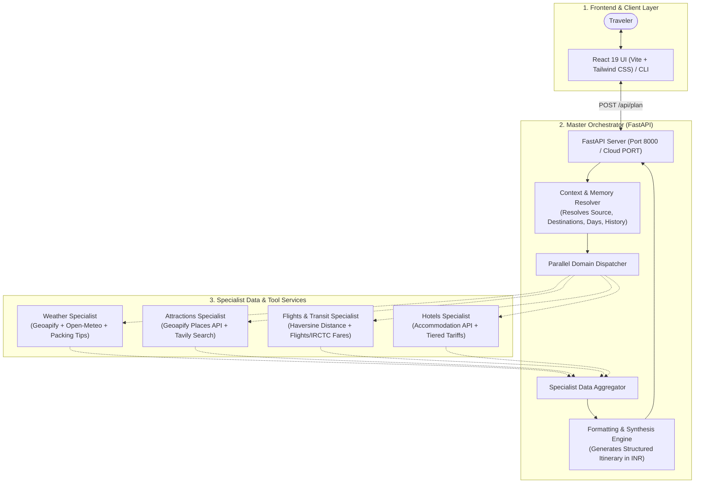

# Multi-Agent AI Travel Planner (A2A Architecture)

An end-to-end full-stack AI travel planning platform built with a multi-agent system. Instead of relying on a single monolithic LLM prompt that hallucinates routes, hotel names, or prices, this project coordinates **Specialist AI Agents** using Google's **Agent Development Kit (ADK)** and the **Agent-to-Agent (A2A)** architecture.

To produce accurate, practical, and grounded itineraries, each agent combines **Structured Geographical & Meteorological APIs** (for verified locations, exact coordinates, and property names) with **Live Web Search** (for real flight schedules, IRCTC train tickets, entry fees, and hotel room tariffs in INR).

---

## Key Features

- **Conversational Memory & Context Resolution**: Seamlessly modifies itineraries (e.g., *"Make it 5 days by adding Lonavala"* or *"Switch hotels to luxury resorts only"*) while preserving original trip details.
- **Parallel Multi-Agent Execution**: 4 specialist domains (Flights & Transit, Weather, Hotels, Attractions) execute in parallel for fast itinerary synthesis.
- **Real Flight & Train Data**: Distinct flight options (IndiGo, Air India, SpiceJet, Akasa) and IRCTC express trains with departure/arrival timings, journey durations, and realistic fares in INR (₹).
- **Tiered Hotel Recommendations**: Real, verified hotel properties categorized strictly into **Luxury / 5-Star / 7-Star**, **Premium / 3-Star & 4-Star**, and **Budget / Cheap Stays** with nightly tariffs in INR.
- **Structured Day-by-Day Itinerary**: Every single day includes dedicated **Morning**, **Afternoon**, and **Evening** blocks with distances, local taxi costs, entry ticket fees, and food budgets.
- **Modern User Interface**:
  - Custom typography with **McLaren** for headers and **Plus Jakarta Sans** for body content with generous letter-spacing and word-spacing.
  - Interactive **Dashboard** with newest-first trip sorting (new plans appear right beside *"Plan New Trip"*).
  - Real-time **Dark / Light Mode** toggle.
  - **PDF Export**, Markdown download, and one-click clipboard copying.
  - **Firebase Authentication** (Google Sign-In) with real-time Cloud Firestore synchronization.

---

## System Architecture



### Architecture Breakdown

| Layer | Component | Implementation | Description |
| :--- | :--- | :--- | :--- |
| **Frontend** | React 19 + Vite | `frontend/` | Responsive UI with Firebase Auth, Cloud Firestore sync, Lucide vector icons, and Dark Mode. |
| **Orchestrator** | FastAPI Backend | `backend/server.py` | Handles conversation memory, parallel agent dispatch, and final itinerary synthesis. |
| **Specialist 1: Weather** | Meteorology Agent | `backend/agents/weather_agent/` | Geoapify geocoding + Open-Meteo / OpenWeatherMap APIs + Tourist packing insights. |
| **Specialist 2: Attractions** | Sightseeing Agent | `backend/agents/attractions_agent/` | Geoapify Places API for verified landmarks + Web search for entry fees and food budgets. |
| **Specialist 3: Flights/Transit** | Transit Agent | `backend/agents/flights_agent/` | Coordinate distance calculations + Live web search for flights, IRCTC trains, and road routes. |
| **Specialist 4: Hotels** | Accommodation Agent | `backend/agents/hotels_agent/` | Geoapify Accommodation API + Web search for Luxury 5-Star, 3/4-Star, and Budget stays. |

---

## Itinerary Output Format

Every generated itinerary follows a uniform, readable Markdown structure:

```markdown
### Flights & Transit Options

#### Flights
- **[Airline 1]**: Dep: [Time] - Arr: [Time] | Price: ₹[Amount] | Duration: [X]h [Y]m
- **[Airline 2]**: Dep: [Time] - Arr: [Time] | Price: ₹[Amount] | Duration: [X]h [Y]m
- **[Airline 3]**: Dep: [Time] - Arr: [Time] | Price: ₹[Amount] | Duration: [X]h [Y]m

#### Trains
- **[Train Name & Number 1]**: Dep: [Time] - Arr: [Time] | Price: ₹[Amount] | Duration: [X]h [Y]m
- **[Train Name & Number 2]**: Dep: [Time] - Arr: [Time] | Price: ₹[Amount] | Duration: [X]h [Y]m
- **[Train Name & Number 3]**: Dep: [Time] - Arr: [Time] | Price: ₹[Amount] | Duration: [X]h [Y]m

#### Road & Local Transit
- **Car / Cab**: ~[X] km | ~[Y] hours drive | Approx. ₹[Fare]
- **Bus / State Transport**: AC Sleeper / Volvo | ~[Y] hours | Approx. ₹[Fare]
- **Local City Transit**: Autos, Metro, and Taxis available for ₹10 - ₹150 per ride.

### Weather Conditions

#### Live Weather & Packing Tips
- **Temperature & Condition**: [Current Temp]°C, [Condition]
- **Humidity & Wind**: [Humidity]%, [Wind Speed] km/h
- **Packing Advice**: [Practical clothing and travel essentials advice]

### Recommended Accommodations

#### Luxury / 5-Star Stays (Top 2)
- **[Hotel Name 1]**: [Location / Highlights] | Approx. ₹[Tariff] / night
- **[Hotel Name 2]**: [Location / Highlights] | Approx. ₹[Tariff] / night

#### Premium / 3-Star & 4-Star Stays (Top 2)
- **[Hotel Name 1]**: [Location / Highlights] | Approx. ₹[Tariff] / night
- **[Hotel Name 2]**: [Location / Highlights] | Approx. ₹[Tariff] / night

#### Budget & Cheap Stays (Top 2)
- **[Hotel Name 1]**: [Location / Highlights] | Approx. ₹[Tariff] / night
- **[Hotel Name 2]**: [Location / Highlights] | Approx. ₹[Tariff] / night

### Detailed Day-by-Day Itinerary

#### Day 1: [City/Region Theme]
- **Morning**: [Activity 1] (Distance: [X] km | Taxi: ₹[Amount] | Entry: ₹[Amount] | Food: ₹[Amount]) • [Activity 2]
- **Afternoon**: [Activity 1] (Distance: [X] km | Taxi: ₹[Amount] | Entry: ₹[Amount] | Food: ₹[Amount]) • [Activity 2]
- **Evening**: [Activity 1] (Taxi: ₹[Amount] | Entry: ₹[Amount]) • Dinner at local restaurant (₹[Amount])

... (Generated for each day)
```

---

## Project Structure

```
Travel_Planner/
├── backend/
│   ├── agents/
│   │   ├── weather_agent/       # Weather APIs + Tourist Packing Search
│   │   ├── attractions_agent/   # Geoapify Places API + Sightseeing Search
│   │   ├── flights_agent/       # Route calculations + Flight/Train Search
│   │   └── hotels_agent/        # Accommodation API + Tiered Hotel Search
│   ├── server.py                # Unified FastAPI orchestrator API
│   ├── start_all.py             # Single-command launcher for all services
│   ├── cli.py                   # Terminal CLI interface
│   ├── Dockerfile               # Docker deployment configuration
│   ├── requirements.txt         # Python dependencies
│   ├── .env.example             # Template for backend secrets
│   └── .env                     # Local backend API keys (git-ignored)
├── frontend/
│   ├── src/
│   │   ├── components/
│   │   │   └── ItineraryDisplay.jsx  # Markdown parser with custom Lucide badges
│   │   ├── App.jsx              # Main Dashboard, Chat, and Trip Workspace
│   │   ├── firebase.js          # Google Authentication & Cloud Firestore config
│   │   ├── index.css            # Typography (McLaren & Plus Jakarta Sans) & Styles
│   │   └── main.jsx             # React DOM root entry
│   ├── public/                  # Static assets & icons
│   ├── vercel.json              # Vercel SPA routing configuration
│   ├── .env.example             # Template for frontend environment variables
│   ├── .env                     # Local frontend configuration (git-ignored)
│   ├── package.json             # Node dependencies & build scripts
│   └── vite.config.js           # Vite build configuration
├── .gitignore                   # Comprehensive secrets & build artifact protection
├── requirements.txt             # Root requirements
└── README.md                    # Project documentation
```

---

## Tech Stack

- **Backend**: Python 3.10+, FastAPI, Uvicorn, LiteLLM (`groq/llama-3.1-8b-instant`), Google ADK (`google-adk`), A2A Protocol (`a2a-sdk`).
- **APIs & Data Providers**:
  - **Geoapify API**: Coordinates, verified attractions, and hotel accommodation properties.
  - **Open-Meteo & OpenWeatherMap**: Real-time meteorological forecasting and climate metrics.
  - **Tavily Search & DuckDuckGo**: Live web queries for fares, train schedules, tickets, and tariffs.
- **Frontend**: React 19, Vite, Tailwind CSS, Lucide React icons, ReactMarkdown, jsPDF, html2canvas.
- **Authentication & Database**: Firebase Auth (Google Sign-In) & Cloud Firestore.
- **Hosting / Deployment**: Render.com (Backend Web Service) + Vercel (Frontend SPA).

---

## Local Setup & Installation

### Prerequisites

- Python 3.10 or higher
- Node.js 18+ and npm
- Required API Keys:
  - **Groq API Key**: [console.groq.com](https://console.groq.com/)
  - **Geoapify API Key**: [myprojects.geoapify.com](https://myprojects.geoapify.com/)
  - **Tavily API Key**: [tavily.com](https://tavily.com/)
  - **OpenWeather API Key** *(Optional)*: [openweathermap.org](https://openweathermap.org/)

---

### Step 1: Backend Setup

1. Open your terminal and create a virtual environment:
   ```bash
   # Conda
   conda create -n travel-a2a python=3.10 -y
   conda activate travel-a2a

   # Or standard venv
   python -m venv venv
   # Windows: venv\Scripts\activate | Linux/macOS: source venv/bin/activate
   ```
2. Navigate to the `backend/` directory and install dependencies:
   ```bash
   cd backend
   pip install -r requirements.txt
   ```
3. Create your `backend/.env` file:
   ```env
   GROQ_API_KEY=your_groq_api_key
   GEOAPIFY_API_KEY=your_geoapify_api_key
   TAVILY_API_KEY=your_tavily_api_key
   OPENWEATHER_API_KEY=your_openweather_api_key
   ```
4. Start the backend server:
   ```bash
   python start_all.py
   ```
   The backend API will start on `http://127.0.0.1:8000`.

---

### Step 2: Frontend Setup

1. Open a new terminal and go to the `frontend/` directory:
   ```bash
   cd frontend
   npm install
   ```
2. Create your `frontend/.env` file:
   ```env
   VITE_BACKEND_URL=http://localhost:8000
   VITE_FIREBASE_API_KEY=your_firebase_api_key
   VITE_FIREBASE_AUTH_DOMAIN=your_project.firebaseapp.com
   VITE_FIREBASE_PROJECT_ID=your_project_id
   VITE_FIREBASE_STORAGE_BUCKET=your_project.firebasestorage.app
   VITE_FIREBASE_MESSAGING_SENDER_ID=your_messaging_sender_id
   VITE_FIREBASE_APP_ID=your_app_id
   VITE_FIREBASE_MEASUREMENT_ID=your_measurement_id
   ```
3. Start the Vite development server:
   ```bash
   npm run dev
   ```
4. Open your browser at `http://localhost:5173`.

---

### Step 3: (Optional) Run via Terminal CLI

To plan trips directly from your command line without starting the web UI:
```bash
cd backend
python cli.py
```

---

## Deployment Guide (Render + Vercel)

Deploy this application using **Render.com** (for the backend) and **Vercel** (for the frontend).

### Part 1: Deploy Backend to Render.com

1. Go to [render.com](https://render.com/) and click **"New +" &rarr; "Web Service"**.
2. Connect your GitHub repository (`multiagent-travel-planner`).
3. Fill in the deployment settings:
   - **Name**: `multiagent-travel-planner`
   - **Language**: `Python 3`
   - **Branch**: `main`
   - **Region**: Singapore *(or closest to your users)*
   - **Root Directory**: `backend`
   - **Build Command**: `pip install -r requirements.txt`
   - **Start Command**: `python start_all.py`
   - **Instance Type**: `Free` ($0/month)
4. Under **Advanced &rarr; Health Check Path**, set: `/api/health`
5. Under **Environment Variables**, add:
   - `GROQ_API_KEY` = `your_key`
   - `GEOAPIFY_API_KEY` = `your_key`
   - `TAVILY_API_KEY` = `your_key`
   - `OPENWEATHER_API_KEY` = `your_key`
6. Click **Create Web Service**. Once live, copy your backend URL:
   `https://multiagent-travel-planner.onrender.com`

---

### Part 2: Deploy Frontend to Vercel

1. Go to [vercel.com](https://vercel.com/) and click **"Add New..." &rarr; "Project"**.
2. Import your GitHub repository (`multiagent-travel-planner`).
3. Configure the project settings:
   - **Framework Preset**: `Vite`
   - **Root Directory**: Click **Edit** &rarr; select `frontend`
   - **Build Command**: `npm run build`
   - **Output Directory**: `dist`
4. Under **Environment Variables**, add:
   - `VITE_BACKEND_URL`: Your Render backend URL (e.g. `https://multiagent-travel-planner.onrender.com` without trailing slash)
   - `VITE_FIREBASE_API_KEY`: Your Firebase API key
   - `VITE_FIREBASE_AUTH_DOMAIN`: Your Firebase Auth domain
   - `VITE_FIREBASE_PROJECT_ID`: Your Firebase Project ID
   - `VITE_FIREBASE_STORAGE_BUCKET`: Your Firebase Storage bucket
   - `VITE_FIREBASE_MESSAGING_SENDER_ID`: Your Firebase Messaging sender ID
   - `VITE_FIREBASE_APP_ID`: Your Firebase App ID
   - `VITE_FIREBASE_MEASUREMENT_ID`: Your Firebase Measurement ID
5. Click **Deploy**. Vercel will build and launch your live application.

---

### Part 3: Authorize Domain in Firebase

1. Open the [Firebase Console](https://console.firebase.google.com/) and select your project.
2. Go to **Authentication &rarr; Settings &rarr; Authorized Domains**.
3. Click **Add domain** and paste your Vercel live domain (e.g., `multiagent-travel-planner.vercel.app`).

---

## Example Prompts

- **Initial trip request**:
  - *"Plan a 3 day trip to Mumbai from Ahmedabad for 2 people with a moderate budget."*
  - *"Plan a 4 day spiritual and sightseeing trip to Varanasi from Delhi."*
  - *"Plan a 2 day weekend trip to Matheran from Pune."*
- **Follow-up modification (memory in action)**:
  - *"Make it 5 days by adding Lonavala."*
  - *"Change hotel recommendations to luxury 5-star resorts only."*
  - *"Add local street food stops and heritage walks for Day 2 evening."*
