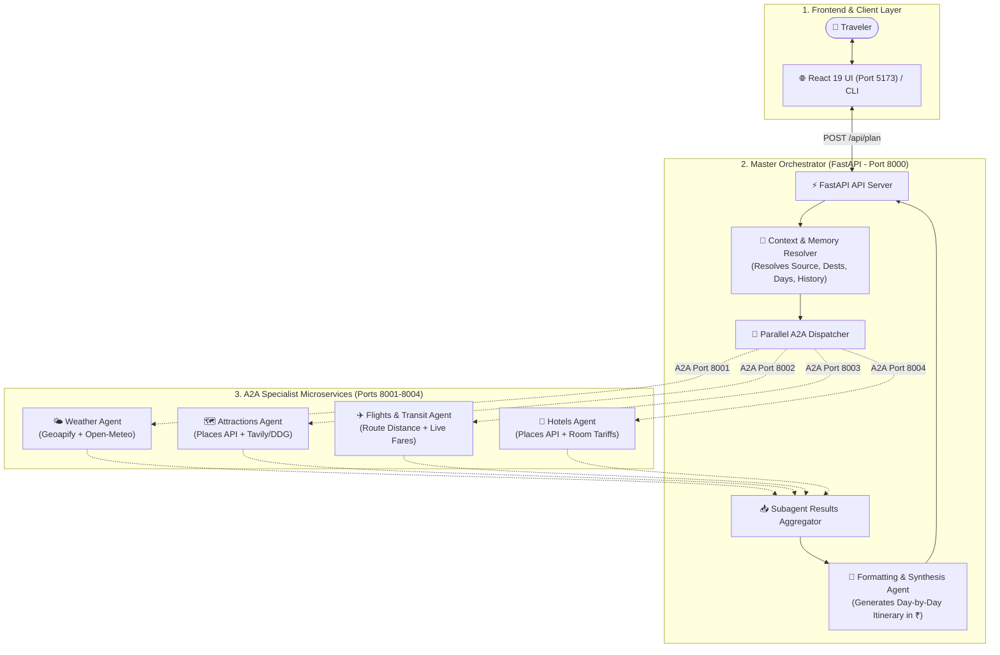

# Multi-Agent Travel Planner (A2A Architecture)

A travel planning application built with a multi-agent system. Instead of asking one single AI prompt to do everything, this project splits the work across specialized AI agents using Google's **Agent Development Kit (ADK)** and the **Agent-to-Agent (A2A)** protocol.

To get the most accurate and grounded travel itineraries, each agent combines **Structured APIs** (for verified locations, exact coordinates, and property names) with **Live Web Search** (for real ticket prices, train schedules, entry fees, and hotel room tariffs in INR).

---

## How It Works

When you ask for a trip plan (e.g. *"Plan a 3-day trip to Mumbai from Ahmedabad"*), here is the workflow:

1. **Context & Memory Resolution**: A context agent reads your message along with your chat history. It extracts your starting city, destinations, trip duration, and understands follow-up edits (like adding a destination or changing trip length).
2. **Hybrid Parallel Agent Dispatch**: The orchestrator queries 4 specialist agents in parallel across separate ports via the A2A protocol:
   - **Weather Agent (Port 8001)**: Combines **Geoapify / Open-Meteo Geocoding** + **OpenWeatherMap** with live web packing advice to provide current temperatures, conditions, and what to wear.
   - **Attractions Agent (Port 8002)**: Combines **Geoapify Places API** (verified sightseeing spots & addresses) with **Tavily / DuckDuckGo search** for real entry fees, timings, and local food budgets.
   - **Flights & Transit Agent (Port 8003)**: Calculates geographic route distances and queries live web searches for flights (airlines, fares), trains (IRCTC / Vande Bharat), and highway driving routes with costs in INR (₹).
   - **Hotels Agent (Port 8004)**: Combines **Geoapify Accommodation API** (verified hotel and resort names) with live web search for actual room tariffs across budget, mid-range, and luxury tiers.
3. **Itinerary Synthesis**: A formatting agent combines all verified sub-agent data into a structured, day-by-day plan with realistic timings and all prices in INR (₹).
4. **Interactive UI**: The React frontend displays the itinerary with category badges and icons, supports dark mode, and saves trip versions using Firebase.

---

## Architecture



### Architecture Breakdown

| Layer                  | Component               | Port     | Description                                                                          |
| :--------------------- | :---------------------- | :------- | :----------------------------------------------------------------------------------- |
| **Frontend**     | React 19 + Tailwind CSS | `5173` | Interactive chat interface with trip versioning, dark mode, and Lucide icons.        |
| **Orchestrator** | FastAPI Backend Server  | `8000` | Coordinates memory extraction, parallel A2A dispatch, and final itinerary synthesis. |
| **Specialist 1** | Weather Agent           | `8001` | Live weather conditions, temperatures, and destination-specific packing tips.        |
| **Specialist 2** | Attractions Agent       | `8002` | Verified tourist attractions, heritage spots, entry fees, and local food budgets.    |
| **Specialist 3** | Flights & Transit Agent | `8003` | Flights, IRCTC trains, road travel distances, and fare estimates in INR (₹).        |
| **Specialist 4** | Hotels Agent            | `8004` | Verified hotel/resort names and nightly tariffs across budget and luxury categories. |

---

## Project Structure

```
Travel_Planner/
├── backend/
│   ├── agents/
│   │   ├── weather_agent/       # Port 8001: Weather API + Packing insights
│   │   ├── attractions_agent/   # Port 8002: Geoapify Places API + Tavily Search
│   │   ├── flights_agent/       # Port 8003: Route calculations + Transit Search
│   │   └── hotels_agent/        # Port 8004: Hotel Places API + Tariff Search
│   ├── root_agent/              # Standalone root agent definition
│   ├── server.py                # FastAPI backend & orchestrator (Port 8000)
│   ├── start_all.py             # Starts all 4 agents + backend server at once
│   ├── cli.py                   # Interactive terminal version of the planner
│   ├── requirements.txt         # Python dependencies
│   └── .env                     # API keys configuration
├── frontend/
│   ├── src/
│   │   ├── components/
│   │   │   └── ItineraryDisplay.jsx  # Formats markdown into UI with icons
│   │   ├── App.jsx              # Main dashboard, chat & trip workspace
│   │   ├── firebase.js          # Google Login & Firestore sync
│   │   └── index.css            # Styles & Dark Mode
│   ├── package.json             # Frontend dependencies
│   └── vite.config.js           # Vite configuration
├── requirements.txt             # Root Python requirements
└── README.md                    # Project documentation
```

---

## Tech Stack

- **Backend**: Python 3.10+, Google ADK (`google-adk`), A2A Protocol SDK (`a2a-sdk`), FastAPI, Uvicorn, LiteLLM with Groq (LLaMA 3.1 8B Instant).
- **APIs & Data Sources**:
  - **Geoapify API**: Geocoding, verified tourist attractions, and hotel accommodation properties.
  - **Open-Meteo & OpenWeatherMap**: Real-time meteorological data and forecasts.
  - **Tavily Search & DuckDuckGo**: Live web extraction for entry ticket fees, flight/train fares, and room tariffs.
- **Frontend**: React 19, Vite, Tailwind CSS, Lucide React icons, React-Markdown.
- **Auth & Database**: Firebase Auth (Google Sign-In) and Cloud Firestore.

---

## Getting Started

### Prerequisites

- Python 3.10 or higher
- Node.js 18+ and npm
- API Keys:
  - **Groq API Key** (Required for LLM orchestration)
  - **Geoapify API Key** (For verified place names, hotels, and geocoding)
  - **Tavily API Key** (For live search of ticket prices, tariffs, and fares)
  - **OpenWeather API Key** (Optional fallback for weather data)

---

### Step 1: Backend Setup

1. Open your terminal and create/activate your virtual environment:

   ```bash
   # Using conda
   conda create -n travel-a2a python=3.10 -y
   conda activate travel-a2a

   # Or using python venv
   python -m venv venv
   # Windows:
   venv\Scripts\activate
   # Linux/macOS:
   source venv/bin/activate
   ```
2. Go to the `backend` folder and install Python dependencies:

   ```bash
   cd backend
   pip install -r requirements.txt
   ```
3. Configure your API keys in `backend/.env`:

   ```env
   GROQ_API_KEY=your_groq_api_key_here
   GEOAPIFY_API_KEY=your_geoapify_api_key_here
   TAVILY_API_KEY=your_tavily_api_key_here
   OPENWEATHER_API_KEY=your_openweather_api_key_here
   ```
4. Start all 4 specialist agents and the backend server with one command:

   ```bash
   python start_all.py
   ```

   This will launch:

   - Weather Agent on `http://127.0.0.1:8001`
   - Attractions Agent on `http://127.0.0.1:8002`
   - Flights Agent on `http://127.0.0.1:8003`
   - Hotels Agent on `http://127.0.0.1:8004`
   - Main Backend API on `http://127.0.0.1:8000`

---

### Step 2: Frontend Setup

1. Open a new terminal window and go to the `frontend` folder:

   ```bash
   cd frontend
   npm install
   ```
2. Start the Vite development server:

   ```bash
   npm run dev
   ```
3. Open your browser at:

   ```
   http://localhost:5173
   ```

---

### Step 3: (Optional) Run via Terminal CLI

If you want to use the travel planner directly from your command line:

1. Make sure your environment is activated.
2. In the `backend` folder, run:
   ```bash
   python cli.py
   ```
3. Type your travel requests directly in the terminal. Type `exit` or `quit` to close.

---

## API Endpoints

### `POST /api/plan`

Generates a new itinerary or updates an existing one.

**Sample Request:**

```json
{
  "message": "Plan a 3 day trip to Mumbai from Ahmedabad",
  "history": [
    { "role": "user", "content": "Hi" }
  ],
  "currentPlan": ""
}
```

**Sample Response:**

```json
{
  "status": "success",
  "source": "Ahmedabad",
  "destination": "Mumbai",
  "destinations": ["Mumbai"],
  "duration_days": 3,
  "itinerary": "### Flights & Transit Options\n...",
  "reply": "### Flights & Transit Options\n..."
}
```

### `GET /api/health`

Checks the live status of the FastAPI backend and all 4 subagents.

---

## 🚀 Deployment Guide (Hugging Face Spaces + Vercel)

You can easily deploy this full-stack multi-agent project for **100% free** using **Hugging Face Spaces** (for the Python backend) and **Vercel** (for the React frontend).

### Part 1: Deploy Backend to Hugging Face Spaces

1. Go to [Hugging Face Spaces](https://huggingface.co/spaces) and click **"Create new Space"**.
2. Set your Space settings:
   - **Space Name**: e.g. `travel-planner-backend`
   - **License**: `mit` / `apache-2.0`
   - **Space SDK**: Select **Docker** (Blank).
   - **Visibility**: Public.
3. Upload the `backend/` files or push via git to your HF Space:
   - Make sure [`Dockerfile`](file:///D:/D%20Drive%20Documents/Programming_D/Projects/AI_Projects/Travel_Planner/backend/Dockerfile), [`requirements.txt`](file:///D:/D%20Drive%20Documents/Programming_D/Projects/AI_Projects/Travel_Planner/backend/requirements.txt), [`server.py`](file:///D:/D%20Drive%20Documents/Programming_D/Projects/AI_Projects/Travel_Planner/backend/server.py), [`start_all.py`](file:///D:/D%20Drive%20Documents/Programming_D/Projects/AI_Projects/Travel_Planner/backend/start_all.py), and the [`agents/`](file:///D:/D%20Drive%20Documents/Programming_D/Projects/AI_Projects/Travel_Planner/backend/agents) folder are in the Space root.
4. Go to **Settings > Variables and secrets > New secret** in your Space and add your environment variables:
   - `GROQ_API_KEY`: Your Groq API key
   - `GEOAPIFY_API_KEY`: Your Geoapify API key
   - `TAVILY_API_KEY`: Your Tavily API key
   - `OPENWEATHER_API_KEY`: Your OpenWeather API key (optional)
5. Hugging Face will build the Docker container and start your server on port `7860`.
6. Copy your public Space URL (e.g. `https://yourusername-travel-planner-backend.hf.space`).

---

### Part 2: Deploy Frontend to Vercel

1. Push your repository to **GitHub**.
2. Go to [Vercel](https://vercel.com/) and click **"Add New..." > "Project"**.
3. Import your GitHub repository.
4. In the project configuration:
   - **Root Directory**: Select `frontend` (or click Edit and select `frontend`).
   - **Framework Preset**: Vite.
   - **Build Command**: `npm run build`
   - **Output Directory**: `dist`
5. Expand **Environment Variables** and add:
   - `VITE_BACKEND_URL`: Paste your Hugging Face Space URL (e.g. `https://yourusername-travel-planner-backend.hf.space` without trailing slash).
6. Click **Deploy**.
7. Vercel will build and launch your live application at `https://your-app-name.vercel.app`!

---

## Example Usage Prompts

- **Initial trip request**:
  - *"Plan a 3 day trip to Mumbai from Ahmedabad for 2 people with a moderate budget."*
  - *"Plan a 4 day spiritual and sightseeing trip to Varanasi from Delhi."*
- **Follow-up modification (memory in action)**:
  - *"Make it 5 days by adding Lonavala."*
  - *"Change the hotel recommendations to luxury resorts only."*
  - *"Add local street food stops for Day 2 evening."*

